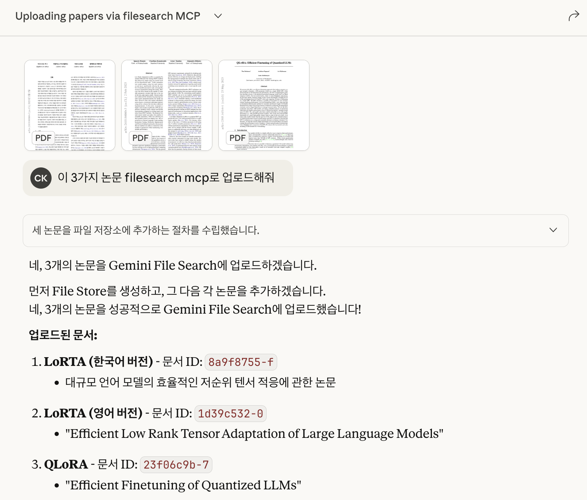
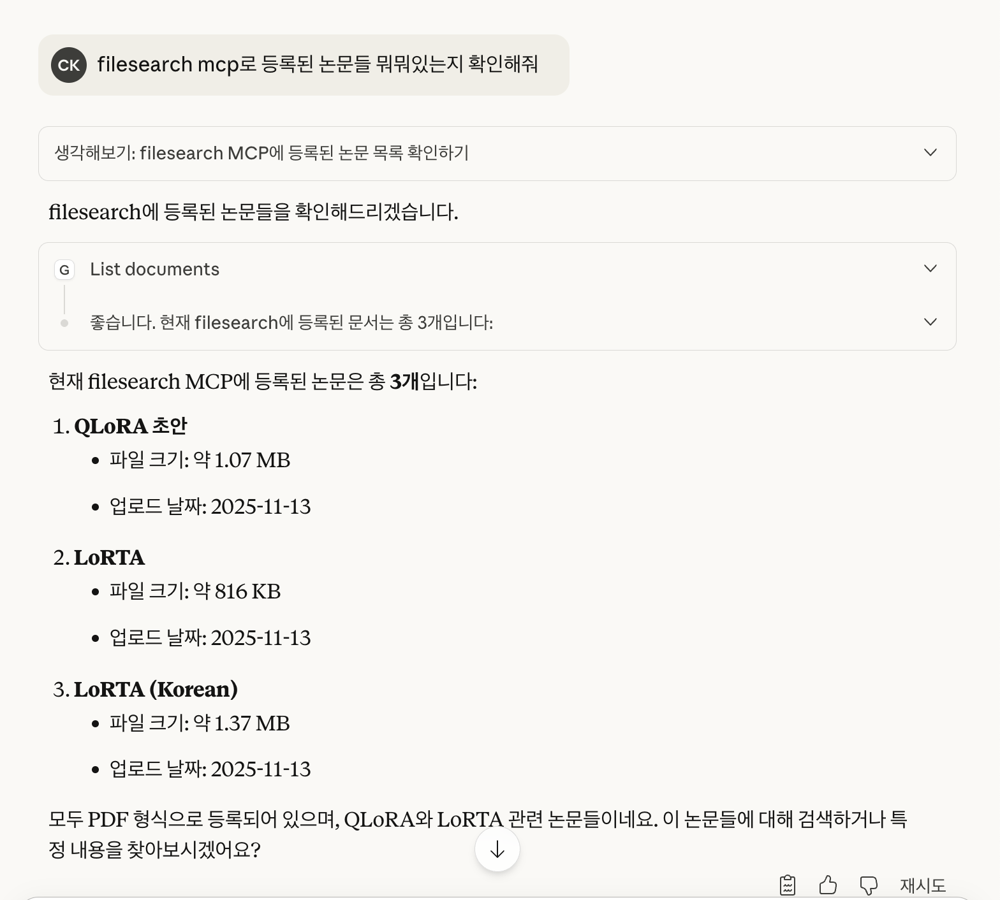
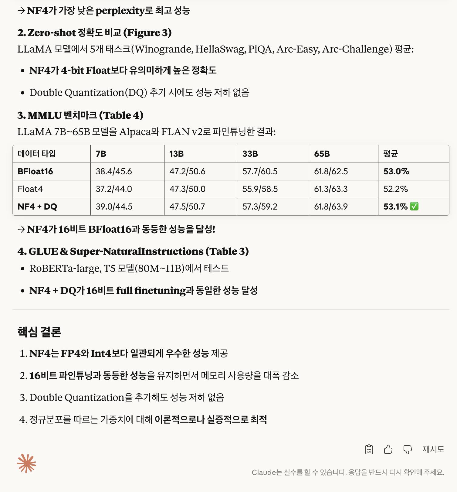

# MCP-Gemini-FileSearch

Google Gemini File Search API를 MCP(Model Context Protocol) 서버로 래핑한 도구입니다. ChatGPT, Claude Desktop 등 MCP 호환 클라이언트에서 문서 기반 RAG 검색을 사용할 수 있습니다.

## Feature

- **Gemini File Search API MCP 래퍼** - MCP 호환 LLM 클라이언트에서 사용 가능
- **파일 업로드** - 로컬 파일 & URL 자동 다운로드 지원
- **자연어 검색** - 문서 내용 기반 RAG 검색
- **인용 검증** - 특정 페이지 본문 조회 (get_passages)
- **메타데이터 관리** - 제목, 저자, 연도, DOI, 태그, 출처 URL
- **필터링 검색** - 연도 범위, 저자, 태그별 검색

## Usage Example

<div style="overflow-x: auto; white-space: nowrap;">
  
  
  
  
</div>

## Quick Start

### mcpServers setup


```json
{
  "mcpServers": {
    "gemini-filesearch": {
      "command": "npx",
      "args": ["mcp-gemini-filesearch"],
      "env": {
        "GEMINI_API_KEY": "AIzaSyXXXXXXXXXXXXXXXX",
        "GEMINI_FILESTORE_NAME": "select-your-store-name"
      }
    }
  }
}
```

## Internal Tool Usage Example

### create_file_store

```json
{
  "display_name": "My Research Store"
}
```

### add_document

Local file:
```json
{
  "source": "/path/to/document.pdf",
  "metadata": {
    "title": "Attention Is All You Need",
    "authors": ["Vaswani", "Shazeer", "Parmar"],
    "year": 2017,
    "tags": ["transformer", "attention"]
  }
}
```

URL:
```json
{
  "source": "https://arxiv.org/pdf/1706.03762.pdf",
  "metadata": {
    "title": "Attention Is All You Need",
    "year": 2017
  }
}
```

### search
```json
{
  "query": "What are the limitations of self-attention?",
  "top_k": 5
}
```

```json
{
  "query": "neural network architectures",
  "top_k": 10,
  "filters": {
    "year_min": 2015,
    "year_max": 2023,
    "tags": ["transformer"]
  }
}
```

### get_passages
retrival specific page
```json
{
  "doc_id": "gemfile_abc123xyz",
  "page_spans": [
    { "start": 3, "end": 4 },
    { "start": 7, "end": 7 }
  ]
}
```

### list_documents

```json
{
  "page": 1,
  "page_size": 20,
  "filters": {
    "year_min": 2015,
    "tags": ["transformer"]
  }
}
```

### delete_document

```json
{
  "doc_id": "gemfile_abc123xyz"
}
```

## Exception
- `FILE_TOO_LARGE`: 파일 크기 초과
- `INVALID_FILE_TYPE`: 지원하지 않는 형식
- `RATE_LIMITED`: API 요청 제한 (자동 재시도)

## Develop
```bash
npm install
npm run build
npm test
npm run lint
```

### Project Structure

```
mcp-gemini-filesearch/
├── bin/cli.js           # CLI 진입점
├── src/
│   ├── server.ts        # MCP 서버
│   ├── tools/           # MCP 도구
│   └── lib/             # 핵심 라이브러리
├── tests/unit/          # 단위 테스트
├── manifest.json        # MCP 메타데이터
└── package.json
```

## Requirement

- Node.js ≥ 20
- TypeScript 5.7
- Model Context Protocol (MCP) 1.0
- Google Gemini File Search API
- Zod 3.23 (Validation)
- Jest 29 (Unit Test)

## 라이선스

MIT License

## 참고

- [Model Context Protocol](https://modelcontextprotocol.io)
- [Google Gemini API](https://ai.google.dev/docs)
